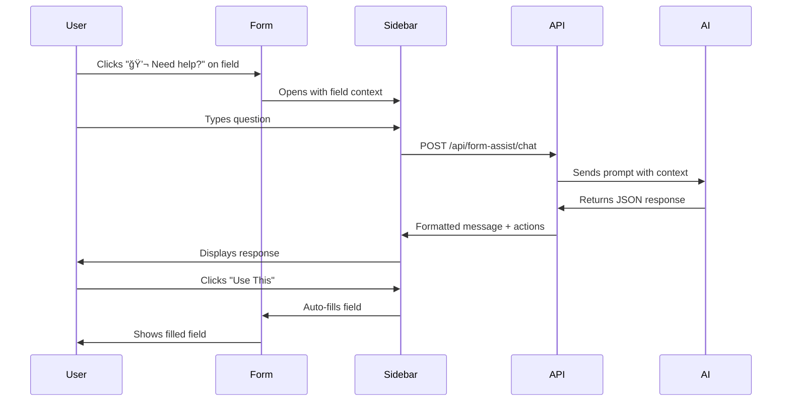

# AI Form Co-Pilot Implementation Guide

**Project:** Market Intelligence Generator - Form Assistance System
**Version:** 1.0
**Date:** January 2025
**Status:** Ready for Implementation

---

## Executive Summary

This document provides complete specifications for implementing an AI Co-Pilot sidebar that helps non-technical users (ages 40-60) fill out the complex 18-field market research form.

**Problem Solved:** 70% of users abandon complex forms due to marketing jargon, blank field paralysis, and uncertainty about what to write.

**Solution:** On-demand AI assistant in a sidebar that explains jargon, provides context-aware examples, and drafts content users can edit.

**Expected Impact:**
- Reduce form abandonment by 25-40%
- Increase average completion time by only 5 minutes (vs. abandonment)
- Cost: ~$0.12 per user (~5 AI interactions)
- User satisfaction: Significant improvement for 40-60 age demographic

---

## Table of Contents

1. [System Architecture](#1-system-architecture)
2. [AI Prompt Engineering](#2-ai-prompt-engineering)
3. [Context Management](#3-context-management)
4. [Interaction Flows](#4-interaction-flows)
5. [UI Component Specifications](#5-ui-component-specifications)
6. [API Specifications](#6-api-specifications)
7. [Cost Analysis](#7-cost-analysis)
8. [Implementation Checklist](#8-implementation-checklist)
9. [Testing Strategy](#9-testing-strategy)
10. [Analytics & Metrics](#10-analytics--metrics)

---

## 1. System Architecture

### 1.1 Component Overview

```
┌─────────────────────────────────────────────────────────â”
│                    Client (Browser)                      │
├─────────────────────────────────────────────────────────┤
│ 1. research-form.tsx (existing form)                    │
│ 2. form-copilot-sidebar.tsx (NEW - chat UI)            │
│ 3. form-copilot.js (NEW - state management)            │
└─────────────────────────────────────────────────────────┘
                            ↕ HTTP POST
┌─────────────────────────────────────────────────────────â”
│                    Server (Cloudflare)                   │
├─────────────────────────────────────────────────────────┤
│ POST /api/form-assist/chat                              │
│   - Receives: field context + conversation history      │
│   - Processes: AI inference with context management     │
│   - Returns: JSON with message + optional actions       │
└─────────────────────────────────────────────────────────┘
                            ↕
┌─────────────────────────────────────────────────────────â”
│         Cloudflare Workers AI (Llama 3.1 70B)           │
└─────────────────────────────────────────────────────────┘
```

### 1.2 Data Flow



### 1.3 State Management

```typescript
interface CoPilotState {
  // Current form context
  formData: Partial<BusinessContext>;
  currentField: FieldMetadata | null;

  // Conversation history (max 6 messages to manage tokens)
  conversation: Message[];

  // UI state
  isOpen: boolean;
  isTyping: boolean;

  // Session tracking
  sessionId: string; // For analytics
  fieldsAssistedWith: string[]; // Track which fields got help
}

interface Message {
  role: 'user' | 'assistant';
  content: string;
  timestamp: number;
  fieldContext?: string; // Which field was active
}

interface FieldMetadata {
  name: string;
  label: string;
  placeholder: string;
  helperText: string;
  type: 'input' | 'textarea' | 'select';
  required: boolean;
  currentValue: string;
  step: number; // Which wizard step (1-3)
}
```

---

## 2. AI Prompt Engineering

### 2.1 Core System Prompt (Always Included)

```typescript
const SYSTEM_PROMPT = `You are a friendly, patient Marketing Form Assistant helping business owners complete a market research form.

## Your Role
You help users who may not understand marketing jargon. You explain concepts in plain English, provide specific examples based on THEIR business (not generic), and offer to draft content they can edit.

## Your Personality
- Warm and encouraging (never condescending)
- Patient and supportive
- Speak like a helpful friend, not a robot
- Use "you" and "your business" (conversational)
- Age-appropriate language for 40-60 year olds

## Your Capabilities
1. **Explain Jargon**: Translate marketing terms into plain English
2. **Provide Examples**: Show specific examples based on their business context
3. **Draft Content**: Offer to write field content they can edit
4. **Ask Clarifying Questions**: If you need more info to help
5. **Validate Input**: Reassure when their answer is good

## Response Format
Respond in conversational paragraphs (NOT bullets unless listing options).
Keep responses SHORT (2-4 sentences usually, max 100 words).
End with a clear next action for the user.

## Critical Rules
- NEVER use the word "leverage" or "synergy" or other corporate jargon
- ALWAYS reference their specific business (don't be generic)
- NEVER make up information about their business you don't have
- If you need more info, ASK specific questions
- When drafting content, use quotation marks so they know it's a suggestion

## Response Structure (JSON)
You must respond with valid JSON in this format:
{
  "message": "Your conversational response here",
  "suggestedContent": "Optional draft text to fill the field (omit if not providing a draft)",
  "action": "fill" | "clarify" | "validate" | "explain"
}

Action types:
- "fill" = You're providing suggested content to fill the field
- "clarify" = You need more information from the user
- "validate" = You're confirming their existing input is good
- "explain" = You're explaining a concept without filling content`;
```

### 2.2 Context Injection Template

```typescript
function buildContextPrompt(state: CoPilotState): string {
  const { formData, currentField, conversation } = state;

  // Only include FILLED fields to save tokens
  const filledFields = Object.entries(formData)
    .filter(([_, value]) => value && value.trim())
    .map(([key, value]) => `- ${formatFieldName(key)}: "${truncate(value, 150)}"`)
    .join('\n');

  const contextPrompt = `
## User's Business Context (from form so far):
${filledFields || '(No fields filled yet)'}

## Current Field User Needs Help With:
- Field Name: "${currentField.label}"
- Field Type: ${currentField.type}
- Helper Text: "${currentField.helperText}"
- Placeholder Example: "${currentField.placeholder}"
- Current Value: "${currentField.currentValue || '(empty)'}"
- Required: ${currentField.required ? 'Yes' : 'No'}

## Recent Conversation:
${formatConversationHistory(conversation, 4)} // Last 4 messages only

## User's Question:
`;

  return contextPrompt;
}

// Helper: Format field name from snake_case to readable
function formatFieldName(fieldName: string): string {
  return fieldName
    .split('_')
    .map(word => word.charAt(0).toUpperCase() + word.slice(1))
    .join(' ');
}

// Helper: Truncate long values to save tokens
function truncate(text: string, maxLength: number): string {
  if (text.length <= maxLength) return text;
  return text.substring(0, maxLength) + '...';
}

// Helper: Format conversation history
function formatConversationHistory(messages: Message[], limit: number): string {
  return messages
    .slice(-limit)
    .map(msg => `${msg.role === 'user' ? 'User' : 'Assistant'}: ${msg.content}`)
    .join('\n');
}
```

### 2.3 Field-Specific Prompt Enhancements

Different fields need different assistance approaches. These enhance the system prompt for specific fields.

#### Field: "Target Psychographics" (Most Confusing)

```typescript
const PSYCHOGRAPHICS_ENHANCEMENT = `
## Special Instructions for "Target Psychographics"
This field confuses most users. Help them understand:
- Psychographics = VALUES (what matters to them) + BELIEFS (what they think is true) + LIFESTYLE (how they spend time/money)
- Give 3-5 specific examples based on their business niche
- Use phrases like "They probably value..." and "They might believe..."
- Format as a paragraph, not bullets (feels more natural)

Example good response:
"Psychographics are your customers' values and beliefs - what drives their decisions beyond demographics. Based on your prenatal coaching business, your customers probably value holistic approaches and natural solutions. They likely believe that healing happens from within and that emotional wellness affects physical health. Their lifestyle probably includes things like yoga, therapy, and podcasts about personal growth. Want me to write that up for your form?"
`;
```

#### Field: "Unique Mechanism" (Second Most Confusing)

```typescript
const UNIQUE_MECHANISM_ENHANCEMENT = `
## Special Instructions for "Unique Mechanism"
Users often don't realize they HAVE a unique mechanism. Help them find it:
- Look at their specialization_keywords and current_offer_description
- Identify what makes their approach DIFFERENT (method, framework, philosophy)
- Name it if possible (e.g., "The [Benefit] [Method]")
- Explain WHY it's different from competitors

Example good response:
"Looking at what you've shared, I can see your unique mechanism! You combine trauma-informed practices with prenatal coaching, which most coaches don't do. Let me suggest: 'The Generational Healing Birth Method - a trauma-informed approach that combines somatic practices with prenatal coaching to break cycles of birth trauma and create secure attachment from conception.' Does that sound close to what you do?"
`;
```

#### Field: "Current Offer Description" (Needs Detail)

```typescript
const OFFER_DESCRIPTION_ENHANCEMENT = `
## Special Instructions for "Current Offer Description"
Users often write 1-2 sentences. Help them expand with the WHAT-WHO-DURATION-RESULT framework:
- Ask WHAT (format: 1:1, group, course?)
- Ask WHO (specific target customer)
- Ask HOW LONG (duration: weeks, months?)
- Ask WHAT RESULT (transformation they get)
- Offer to assemble their answers into a complete paragraph

Example good response:
"Good start! To get you a great report, I need a bit more detail. Can you tell me: How do you deliver this (1:1 calls? Group program? Course)? How long does it take (weeks? months?)? And what specific transformation do your clients get? I'll weave it all together for you into a complete description."
`;
```

#### Field: "Target Demographics" (Often Too Vague)

```typescript
const DEMOGRAPHICS_ENHANCEMENT = `
## Special Instructions for "Target Demographics"
Users often write vague descriptions like "women 30-50". Help them be specific:
- Ask about AGE RANGE (narrow it: "30-50" → "35-42")
- Ask about INCOME (specific range: "$150K-$300K household income")
- Ask about LOCATION (urban/suburban? Specific cities?)
- Ask about EDUCATION level
- Ask about FAMILY STATUS (married? Kids? Pregnant?)

Example good response:
"Let's make this more specific so the AI gives you better insights. Instead of just 'women 30-50', can you narrow it? Like: 'Women 35-42, household income $200K-$400K, urban/suburban areas, college-educated, married or partnered, currently pregnant or planning pregnancy within 12 months.' See how much more detailed that is? Want me to help you build that level of detail?"
`;
```

### 2.4 Complete Prompt Assembly Function

```typescript
async function buildCompleteCoPilotPrompt(
  userMessage: string,
  state: CoPilotState
): Promise<string> {
  const systemPrompt = SYSTEM_PROMPT;
  const contextPrompt = buildContextPrompt(state);

  // Add field-specific enhancement if applicable
  let fieldEnhancement = '';
  if (state.currentField) {
    switch (state.currentField.name) {
      case 'target_psychographics':
        fieldEnhancement = PSYCHOGRAPHICS_ENHANCEMENT;
        break;
      case 'unique_mechanism':
        fieldEnhancement = UNIQUE_MECHANISM_ENHANCEMENT;
        break;
      case 'current_offer_description':
        fieldEnhancement = OFFER_DESCRIPTION_ENHANCEMENT;
        break;
      case 'target_demographics':
        fieldEnhancement = DEMOGRAPHICS_ENHANCEMENT;
        break;
    }
  }

  return `${systemPrompt}\n\n${contextPrompt}\n\n${fieldEnhancement}\n\n${userMessage}`;
}
```

---

## 3. Context Management

### 3.1 Token Budget Allocation (24K Context Window)

```typescript
const TOKEN_BUDGET = {
  system_prompt: 450,           // Core personality & instructions
  field_metadata: 150,          // Current field context
  form_context: 800,            // Filled fields (truncated)
  conversation_history: 600,    // Last 4 messages
  field_enhancement: 250,       // Specialized instructions
  user_message: 200,            // Current question
  buffer: 550,                  // Safety margin
  // --------------------------------
  total_input: ~3000,           // Leaves 21K for response
  max_output_tokens: 400        // Short responses (100 words)
};
```

### 3.2 Conversation History Pruning

```typescript
function pruneConversationHistory(messages: Message[]): Message[] {
  // Keep only last 4 messages (2 exchanges) + always keep first greeting
  const firstGreeting = messages[0];
  const recentMessages = messages.slice(-4);

  // If first message isn't in recent, prepend it
  if (recentMessages[0]?.timestamp !== firstGreeting?.timestamp) {
    return [firstGreeting, ...recentMessages];
  }

  return recentMessages;
}
```

### 3.3 Form Context Prioritization

Only include the most relevant form fields to save tokens:

```typescript
function buildFormContextSummary(formData: Partial<BusinessContext>): string {
  // Priority order: Most important fields for context
  const PRIORITY_FIELDS = [
    'business_name',              // Always include (identity)
    'niche',                      // Core context
    'current_offer_description',  // What they do
    'target_market_hypothesis',   // Who they serve
    'service_type',               // Format
  ];

  const OTHER_FIELDS = Object.keys(formData).filter(
    key => !PRIORITY_FIELDS.includes(key) && formData[key]
  );

  // Include all priority fields + up to 3 other filled fields
  const fieldsToInclude = [
    ...PRIORITY_FIELDS.filter(key => formData[key]),
    ...OTHER_FIELDS.slice(0, 3)
  ];

  return fieldsToInclude
    .map(key => `- ${formatFieldName(key)}: "${truncate(formData[key], 150)}"`)
    .join('\n');
}
```

---

## 4. Interaction Flows

### Flow 1: Initial Greeting

**Trigger:** User clicks "💬 Get Help" button for first time

**AI Response:**
```json
{
  "message": "Hi! I'm here to help you fill out this form. I know some of these questions can be tricky, especially if marketing isn't your thing. Just click the 💬 button next to any field you're stuck on, and I'll explain what it means and help you write a great answer. Ready to get started?",
  "action": "greet"
}
```

### Flow 2: User Stuck on Jargon Field

**Scenario:** User doesn't understand "psychographics"

**User Message:** "What even is psychographics?"

**Expected AI Response:**
```json
{
  "message": "Great question! Psychographics are your customers' values and beliefs - what drives their decisions beyond just age and income. For your prenatal coaching business, think about: What do they value? (Maybe holistic wellness, emotional connection with baby, healing trauma) What do they believe? (Your body knows how to birth, healing yourself protects your baby) How do they spend their time? (Therapy, yoga, reading parenting books). Want me to write a draft based on that?",
  "action": "explain"
}
```

### Flow 3: User Accepts Draft Suggestion

**User Message:** "Yes, write that for me"

**Expected AI Response:**
```json
{
  "message": "Perfect! Here's what I'd suggest:",
  "suggestedContent": "My ideal clients value holistic wellness and natural approaches to pregnancy and parenting. They believe that emotional healing is essential for healthy child development and that unresolved trauma can impact their children. They're proactive about personal growth, often engaging in therapy, prenatal yoga, meditation, and reading books about conscious parenting and attachment theory. They prioritize emotional connection over conventional parenting advice.",
  "action": "fill"
}
```

**UI Flow:**
1. AI message appears with suggestion box below
2. Suggestion box shows draft content with two buttons: [Use This] [Let Me Edit It First]
3. If [Use This]: Content auto-fills form field → green checkmark "✓ Field filled!"
4. If [Let Me Edit It First]: Content copies to field → field gets focus → user can edit

### Flow 4: User Has Partial Content, Needs Expansion

**Scenario:** User wrote "I help women prepare for birth" (only 7 words, needs more)

**User Message:** "I started but I don't know what else to add"

**Expected AI Response:**
```json
{
  "message": "Good start! To get you a great report, I need a bit more detail. Can you tell me: How do you help them? (1:1 sessions, a course, a group program?) What transformation do they get? (Confident birth, less anxiety, better recovery?) And how long does your program take? Just give me quick answers and I'll write it up nicely for you.",
  "action": "clarify"
}
```

**Follow-up User Message:** "6 month 1:1 program, they feel confident and connected to baby"

**Expected AI Response:**
```json
{
  "message": "Perfect! Here's a complete description:",
  "suggestedContent": "I help women prepare for birth through a comprehensive 6-month 1:1 coaching program. Using trauma-informed somatic practices and conscious parenting principles, I guide expecting mothers to feel confident in their birth choices, deeply connected to their baby, and empowered to trust their body's innate wisdom. By the end of our work together, clients have released fears and limiting beliefs, developed practical coping strategies for labor, and created a foundation for secure attachment that begins in the womb.",
  "action": "fill"
}
```

### Flow 5: User Doesn't Think They Have an Answer

**Scenario:** User on "Unique Mechanism" field, feels they don't have one

**User Message:** "I don't have a unique mechanism. I just do coaching."

**Expected AI Response:**
```json
{
  "message": "I bet you do have one - you just don't see it yet! Looking at your form, you combine prenatal coaching with trauma-informed and somatic practices. That's actually pretty unique! Most prenatal coaches don't focus on healing generational trauma. Let me suggest: 'The Generational Healing Birth Method - combining trauma-informed somatic practices with prenatal coaching to break cycles of birth trauma and create secure attachment from conception.' Does that feel like what you do?",
  "action": "validate"
}
```

**Key Pattern:** AI synthesizes info from multiple fields, reframes their work positively, asks for confirmation.

### Flow 6: User Rejects AI Suggestion

**User Message:** "No, that's not quite right. I don't really focus on birth trauma."

**Expected AI Response:**
```json
{
  "message": "Got it! Thanks for clarifying. So you focus more on the prenatal period and conscious parenting preparation, but not specifically birth trauma. What would you say IS the main transformation you help with? Like, what do moms say is different after working with you?",
  "action": "clarify"
}
```

**Key Pattern:** Gracefully accept rejection, ask clarifying question, iterate.

### Flow 7: User Asks Off-Topic Question

**User Message:** "What's the weather today?"

**Expected AI Response:**
```json
{
  "message": "I'm specifically here to help you with this market research form, so I can't help with weather! 😊 But I'm great at explaining marketing terms or helping you write content for any of the form fields. What field are you working on?",
  "action": "redirect"
}
```

**Key Pattern:** Politely redirect to form-related help.

---

## 5. UI Component Specifications

### 5.1 Sidebar Layout (Desktop)

```
┌─────────────────────────────────────â”
│ 💬 Form Assistant            [×]    │ ↠Header (sticky, bg-blue-600)
├─────────────────────────────────────┤
│                                     │
│  [AI Avatar Icon]                   │
│  Hi! I'm here to help you...       │
│  (timestamp: 2m ago)                │
│                                     │
│  ┌────────────────────────────────â”│
│  │ What even is psychographics?   ││ ↠User message (bg-gray-200, right-aligned)
│  └────────────────────────────────┘│
│  (timestamp: 1m ago)                │
│                                     │
│  [AI Avatar Icon]                   │
│  Great question! Psychographics... │ ↠AI response (bg-blue-100, left-aligned)
│  (timestamp: just now)              │
│                                     │
│  ┌──────────────────────────────┠ │
│  │ [Suggested draft content]    │  │ ↠Suggestion box (bg-green-50, border-green-300)
│  │                              │  │
│  │ [Use This] [Edit First]      │  │ ↠Action buttons
│  └──────────────────────────────┘  │
│                                     │
│ ▼ (scroll for more messages)       │
│                                     │
├─────────────────────────────────────┤
│ [Type your question...]       [→]  │ ↠Input (sticky bottom, with send button)
└─────────────────────────────────────┘

Width: 380px (desktop)
Height: 100vh (full height)
Position: Fixed right, slide-in animation
```

### 5.2 Per-Field Help Trigger

Each form field gets a help button added:

```html
<div class="form-field-group">
  <label class="block text-sm font-semibold text-gray-700 mb-1">
    Target Psychographics <span class="text-red-500">*</span>
  </label>
  <textarea
    name="target_psychographics"
    required
    rows={3}
    class="w-full px-4 py-2 border border-gray-300 rounded-lg"
  ></textarea>

  <!-- NEW: Co-pilot trigger button -->
  <div class="flex items-center justify-between mt-1">
    <button
      type="button"
      class="copilot-trigger text-blue-600 text-sm hover:text-blue-700 flex items-center gap-1"
      data-field="target_psychographics"
      onclick="openCoPilotForField('target_psychographics')"
    >
      💬 Need help with this?
    </button>
    <span class="text-sm text-gray-500">
      Values, beliefs, lifestyle patterns
    </span>
  </div>
</div>
```

### 5.3 Responsive Behavior

**Desktop (>1024px):**
- Sidebar is 380px wide, slides in from right
- Form container shrinks to make room (max-width adjusts)
- Sidebar persistent once opened (sticky)
- Close button [×] in top-right corner

**Tablet (768-1024px):**
- Sidebar overlays form at 60% width
- Dark backdrop (bg-black/50) behind sidebar
- Tap backdrop to close
- Sidebar slides in from right

**Mobile (<768px):**
- Sidebar becomes full-screen modal
- Slides up from bottom with animation
- "↠Back to form" button in header instead of [×]
- Full-height to accommodate keyboard

### 5.4 Component File Structure

```
src/components/form-copilot-sidebar.tsx
├── CoPilotSidebar (main component)
│   ├── Header (with close button)
│   ├── MessageList (scrollable chat history)
│   │   ├── Message (user or AI)
│   │   ├── SuggestionBox (when AI provides draft)
│   │   └── TypingIndicator (animated dots)
│   └── InputArea (sticky bottom with send button)

public/static/form-copilot.js
├── State management (CoPilotState)
├── API communication
├── LocalStorage persistence
├── Message formatting
└── Field context extraction
```

---

## 6. API Specifications

### 6.1 Endpoint: `POST /api/form-assist/chat`

**Purpose:** Handle co-pilot chat interactions with context-aware AI responses.

**Request Format:**
```typescript
interface CoPilotChatRequest {
  userMessage: string;
  fieldContext: FieldMetadata;
  formData: Partial<BusinessContext>;
  conversationHistory: Message[]; // Last 4 messages
  sessionId: string; // For analytics
}
```

**Example Request:**
```json
{
  "userMessage": "What is psychographics?",
  "fieldContext": {
    "name": "target_psychographics",
    "label": "Target Psychographics",
    "placeholder": "What do they value? What beliefs drive their decisions?",
    "helperText": "Values, beliefs, lifestyle patterns, priorities",
    "type": "textarea",
    "required": true,
    "currentValue": "",
    "step": 2
  },
  "formData": {
    "business_name": "Conscious Parenting Coaching",
    "niche": "Prenatal & parenting coaching with trauma-informed approach",
    "current_offer_description": "I help expecting mothers prepare for birth..."
  },
  "conversationHistory": [],
  "sessionId": "abc123-session-id"
}
```

**Response Format:**
```typescript
interface CoPilotChatResponse {
  message: string;
  suggestedContent?: string; // Optional draft content
  action: 'fill' | 'clarify' | 'validate' | 'explain' | 'redirect';
  error?: string; // Only if error occurred
}
```

**Example Response:**
```json
{
  "message": "Great question! Psychographics are your customers' values and beliefs - what drives their decisions beyond demographics. For your prenatal coaching business, think about: What do they value? (Holistic wellness, emotional connection with baby) What do they believe? (Healing trauma protects baby) Want me to write a draft?",
  "action": "explain"
}
```

**Error Response:**
```json
{
  "message": "I'm having trouble connecting right now. Here's a quick tip: Psychographics are your customers' values, beliefs, and lifestyle. Think about what matters to them beyond age and income.",
  "action": "explain",
  "error": "AI_TIMEOUT"
}
```

### 6.2 Implementation Pseudocode

```typescript
app.post("/api/form-assist/chat", async (c) => {
  try {
    const request: CoPilotChatRequest = await c.req.json();

    // 1. Build complete prompt with context
    const state: CoPilotState = {
      formData: request.formData,
      currentField: request.fieldContext,
      conversation: request.conversationHistory,
      isOpen: true,
      isTyping: false,
      sessionId: request.sessionId,
      fieldsAssistedWith: []
    };

    const prompt = buildCompleteCoPilotPrompt(request.userMessage, state);

    // 2. Call AI with prompt
    const aiResponse = await c.env.AI.run(
      "@cf/meta/llama-3.1-70b-instruct",
      {
        messages: [
          { role: "system", content: SYSTEM_PROMPT },
          { role: "user", content: prompt }
        ],
        max_tokens: 400,
        temperature: 0.7,
        stream: false,
        response_format: { type: "json_object" }
      },
      getGatewayConfig(c.env.AI_GATEWAY_NAME)
    );

    // 3. Parse JSON response
    let parsedResponse: CoPilotChatResponse;
    try {
      parsedResponse = JSON.parse(aiResponse.response);
    } catch (e) {
      // Fallback if JSON parsing fails
      parsedResponse = {
        message: aiResponse.response.substring(0, 500),
        action: "explain"
      };
    }

    // 4. Return response
    return c.json(parsedResponse);

  } catch (error) {
    console.error('Co-pilot error:', error);

    // Return helpful fallback message
    return c.json({
      message: "I'm having trouble right now. Try describing what you need help with in your own words, or skip this field and come back to it later.",
      action: "explain",
      error: "SERVER_ERROR"
    }, 500);
  }
});
```

---

## 7. Cost Analysis

### 7.1 Token Usage Per Interaction

```typescript
// Estimated token costs per co-pilot interaction
const COST_PER_INTERACTION = {
  input_tokens: 2800,      // ~$0.025 per interaction (avg prompt size)
  output_tokens: 300,      // ~$0.002 per interaction (400 token limit)
  total_cost: 0.027        // ~$0.03 per question
};

// Estimated usage patterns (based on UX research)
const AVERAGE_USAGE = {
  fields_with_help: 3,           // Most users need help with 3 fields
  questions_per_field: 1.5,      // Average 1.5 exchanges per field
  total_interactions: 4.5,       // 3 * 1.5
  total_cost_per_user: 0.12      // ~$0.12 per user completing form
};

// Monthly cost projection
const MONTHLY_PROJECTION = {
  users_per_month: 1000,
  cost_per_user: 0.12,
  total_monthly_cost: 120,  // $120/month for 1000 users
  cost_per_completed_form: 0.42  // Includes $0.30 research generation
};
```

### 7.2 Cost Optimization Strategies

**1. Lazy Loading:** Only load co-pilot JavaScript when user first clicks help

**2. Conversation Pruning:** Keep only last 4 messages (saves ~800 tokens per request)

**3. Form Context Truncation:** Limit form context to 5 priority fields + 3 others (saves ~500 tokens)

**4. Response Token Limiting:** Force max 400 output tokens (saves cost, keeps responses focused)

**5. Field-Specific Context:** Only send relevant field metadata, not entire form schema

### 7.3 ROI Analysis

**Current State (Without Co-Pilot):**
- Form abandonment rate: ~70%
- Users who complete: 300/1000
- Cost per completion: $0.30 (research generation only)
- Total monthly cost: $90

**With Co-Pilot:**
- Form abandonment rate: ~30% (projected 40% reduction)
- Users who complete: 700/1000
- Cost per completion: $0.42 ($0.30 + $0.12 co-pilot)
- Total monthly cost: $294

**Value Gained:**
- 400 additional completions per month
- Better quality inputs → better AI reports
- Reduced support requests about form confusion
- Higher user satisfaction (especially 40-60 demographic)

---

## 8. Implementation Checklist

### Phase 1: Backend (2-3 days)

- [ ] **Create API endpoint** `POST /api/form-assist/chat`
  - File: `src/index.tsx`
  - Add after existing research endpoints

- [ ] **Implement prompt building functions**
  - Create: `src/prompts/copilot-system.ts` (system prompt)
  - Create: `src/prompts/copilot-fields.ts` (field enhancements)
  - Function: `buildCompleteCoPilotPrompt()`

- [ ] **Add context management utilities**
  - Function: `buildContextPrompt()`
  - Function: `pruneConversationHistory()`
  - Function: `buildFormContextSummary()`

- [ ] **Integrate AI Gateway** (already configured)
  - Use existing `getGatewayConfig()` helper

- [ ] **Add error handling**
  - Try-catch around AI calls
  - Fallback messages for errors
  - JSON parsing error handling

- [ ] **Add logging for analytics**
  - Log: field requested help on
  - Log: conversation length
  - Log: token usage
  - Log: success/error rates

### Phase 2: Frontend - State Management (1 day)

- [ ] **Create state management file**
  - File: `public/static/form-copilot.js`

- [ ] **Define CoPilotState interface**
  - formData tracking
  - currentField tracking
  - conversation history
  - UI state (isOpen, isTyping)
  - sessionId generation

- [ ] **Implement state functions**
  - `initializeCoPilot()`
  - `openCoPilotForField(fieldName)`
  - `closeCoPilot()`
  - `sendMessage(message)`
  - `handleAIResponse(response)`
  - `fillFieldWithSuggestion(content)`

- [ ] **Add LocalStorage persistence**
  - Save: conversation history
  - Save: sessionId
  - Save: fieldsAssistedWith (analytics)
  - Clear: on form submission

### Phase 3: Frontend - UI Components (2-3 days)

- [ ] **Create sidebar component**
  - File: `src/components/form-copilot-sidebar.tsx`

- [ ] **Build subcomponents**
  - Header (with close button)
  - MessageList (scrollable container)
  - Message (user + AI variants)
  - SuggestionBox (draft content display)
  - TypingIndicator (animated dots)
  - InputArea (text input + send button)

- [ ] **Add animations**
  - Slide-in from right (desktop/tablet)
  - Slide-up from bottom (mobile)
  - Message fade-in
  - Typing indicator pulse

- [ ] **Implement responsive behavior**
  - Desktop: 380px sidebar, form shrinks
  - Tablet: 60% overlay with backdrop
  - Mobile: Full-screen modal

### Phase 4: Form Integration (1 day)

- [ ] **Modify research-form.tsx**
  - Import: `<CoPilotSidebar />`
  - Add: Sidebar container div
  - Add: "💬 Need help?" button to each field
  - Add: Field click handlers
  - Add: Field metadata extraction

- [ ] **Add per-field triggers**
  - Add button to all 18 fields
  - Set data-field attribute
  - Style consistently

- [ ] **Handle field value syncing**
  - When AI fills field → update form state
  - When user manually edits → update state
  - Track which fields were AI-assisted

### Phase 5: Styling (1 day)

- [ ] **Create CSS file** `public/static/copilot.css`

- [ ] **Style components**
  - Sidebar container
  - Message bubbles (user vs AI)
  - Suggestion boxes
  - Buttons (primary/secondary)
  - Input area
  - Animations (slide, fade, pulse)

- [ ] **Add responsive styles**
  - Desktop media queries
  - Tablet media queries
  - Mobile media queries
  - Dark mode support (optional)

### Phase 6: Testing (2 days)

- [ ] **Test all interaction flows**
  - Flow 1: Initial greeting
  - Flow 2: Jargon explanation
  - Flow 3: Accept draft
  - Flow 4: Partial content expansion
  - Flow 5: Confidence building
  - Flow 6: Rejection handling
  - Flow 7: Off-topic redirect

- [ ] **Test error scenarios**
  - AI API timeout
  - Invalid JSON response
  - Network error
  - Field switching mid-conversation

- [ ] **Test responsive design**
  - Desktop (>1024px)
  - Tablet (768-1024px)
  - Mobile (<768px)
  - Different browsers

- [ ] **User testing** (if possible)
  - Test with 40-60 year old users
  - Observe confusion points
  - Collect feedback
  - Iterate on prompts

### Phase 7: Analytics & Monitoring (1 day)

- [ ] **Add analytics tracking**
  - Track: co-pilot usage rate (% who click help)
  - Track: most frequently requested fields
  - Track: average interactions per user
  - Track: form completion rate (before/after)

- [ ] **Add cost monitoring**
  - Track: tokens per request
  - Track: cost per user
  - Alert: if costs exceed threshold

- [ ] **Add quality monitoring**
  - Track: error rate
  - Track: fallback usage rate
  - Track: user satisfaction (optional survey)

---

## 9. Testing Strategy

### 9.1 Unit Testing (Optional)

```typescript
// Test prompt building
describe('buildCompleteCoPilotPrompt', () => {
  it('should include system prompt', () => {
    const prompt = buildCompleteCoPilotPrompt('test', mockState);
    expect(prompt).toContain('Marketing Form Assistant');
  });

  it('should include field context', () => {
    const prompt = buildCompleteCoPilotPrompt('test', mockState);
    expect(prompt).toContain('Target Psychographics');
  });

  it('should truncate long values', () => {
    const longValue = 'a'.repeat(300);
    const prompt = buildCompleteCoPilotPrompt('test', {
      ...mockState,
      formData: { business_name: longValue }
    });
    expect(prompt.length).toBeLessThan(5000);
  });
});
```

### 9.2 Integration Testing

**Test Scenarios:**

1. **Complete Happy Path**
   - User opens form
   - Clicks help on "psychographics"
   - Asks "what is this?"
   - AI explains concept
   - AI offers to draft
   - User accepts
   - Field auto-fills
   - User submits form

2. **Multi-Field Assistance**
   - User gets help on 3 different fields
   - Conversation history is maintained
   - Context includes previous field info
   - All fields successfully filled

3. **Error Recovery**
   - AI API times out
   - Fallback message displays
   - User can retry
   - Eventually succeeds

### 9.3 User Acceptance Testing

**Target Users:** 5-10 business owners aged 40-60, non-technical background

**Test Protocol:**
1. Give them the form (no instructions)
2. Observe where they get stuck
3. See if they discover co-pilot button
4. Observe their interactions with co-pilot
5. Note any confusion or frustration
6. Collect feedback after completion

**Success Metrics:**
- 80%+ discover co-pilot on their own
- 90%+ understand how to use it after first use
- 70%+ complete form with co-pilot help
- 4+/5 satisfaction rating

---

## 10. Analytics & Metrics

### 10.1 Key Performance Indicators (KPIs)

**Primary Metrics:**
- **Form Completion Rate:** Target 70% (up from 30%)
- **Co-Pilot Usage Rate:** % of users who click help (target 60%)
- **Average Time to Complete:** Target <20 minutes
- **Cost Per Completed Form:** Target <$0.50

**Secondary Metrics:**
- **Most Requested Fields:** Which fields get most help requests
- **Average Interactions Per User:** Target 4-5
- **Suggestion Acceptance Rate:** % of AI drafts accepted (target 70%)
- **Error Rate:** % of AI calls that fail (target <5%)

### 10.2 Analytics Implementation

```typescript
// Track co-pilot usage
function trackCoPilotEvent(eventName: string, data: any) {
  // Send to analytics service (e.g., Google Analytics, Mixpanel)
  if (typeof gtag !== 'undefined') {
    gtag('event', eventName, {
      ...data,
      sessionId: state.sessionId,
      timestamp: Date.now()
    });
  }

  // Also log to console for debugging
  console.log('[CoPilot Analytics]', eventName, data);
}

// Example events to track:
trackCoPilotEvent('copilot_opened', { fieldName: 'target_psychographics' });
trackCoPilotEvent('message_sent', { fieldName: 'target_psychographics', messageLength: 25 });
trackCoPilotEvent('suggestion_accepted', { fieldName: 'target_psychographics', suggestionLength: 200 });
trackCoPilotEvent('suggestion_rejected', { fieldName: 'target_psychographics' });
trackCoPilotEvent('field_filled_with_ai', { fieldName: 'target_psychographics' });
trackCoPilotEvent('form_completed', { fieldsAssistedWith: ['psychographics', 'unique_mechanism'] });
```

### 10.3 A/B Testing Plan

**Hypothesis:** Co-pilot sidebar increases form completion by 40%

**Test Setup:**
- **Control Group:** Standard form (no co-pilot)
- **Treatment Group:** Form with co-pilot
- **Split:** 50/50
- **Duration:** 2 weeks
- **Sample Size:** 1000 users (500 per group)

**Metrics to Compare:**
- Form completion rate
- Average time to complete
- Field completion quality (subjective review)
- User satisfaction (optional survey)

---

## 11. Future Enhancements (Post-MVP)

### Phase 2 Features (If Phase 1 Succeeds)

1. **Voice Input** (Accessibility)
   - Add microphone button to input area
   - Use Web Speech API for voice-to-text
   - Especially helpful for 50-60 age group

2. **Smart Pre-Fill Suggestions**
   - After user fills 3-4 fields, offer to pre-fill rest
   - "I see a pattern - want me to suggest answers for the remaining fields?"

3. **Field Validation Feedback**
   - Green checkmark when field has good detail
   - Yellow warning when field seems too short
   - Proactive: "This looks a bit short - want help expanding it?"

4. **Multi-Language Support**
   - Detect browser language
   - Offer co-pilot in Spanish, French, etc.
   - System prompt translated appropriately

5. **Example Library**
   - "Show me examples from similar businesses"
   - Pull from database of anonymized high-quality examples
   - Filter by industry/niche

---

## 12. Troubleshooting Guide

### Common Issues & Solutions

**Issue:** AI responses are too generic

**Solution:** Ensure `buildFormContextSummary()` is including filled fields in context. Check that field enhancements are being applied for specific fields.

---

**Issue:** Token budget exceeded (context too large)

**Solution:** Implement more aggressive truncation in `truncate()` function. Reduce conversation history limit from 4 to 2 messages. Exclude less important fields from context.

---

**Issue:** Users don't discover co-pilot button

**Solution:** Make button more prominent (larger, different color). Add pulsing animation on first field. Show tooltip on first page load: "Click 💬 for help with any field"

---

**Issue:** AI suggests content that's off-brand

**Solution:** Add more personality constraints to system prompt. Include brand tone guidelines in field enhancements. Add user feedback mechanism to report bad suggestions.

---

**Issue:** High cost per user

**Solution:** Implement smart model selection (use 8B for simple questions, 70B for content generation). Reduce max_tokens to 300. Implement caching for common questions.

---

## 13. Deployment Checklist

### Pre-Deployment

- [ ] All tests passing
- [ ] Error handling tested
- [ ] Responsive design verified on all devices
- [ ] Cost monitoring in place
- [ ] Analytics tracking implemented
- [ ] Documentation complete

### Deployment Steps

1. **Deploy backend changes**
   ```bash
   npm run build
   npm run deploy
   ```

2. **Verify API endpoint**
   ```bash
   curl -X POST https://[your-domain]/api/form-assist/chat \
     -H "Content-Type: application/json" \
     -d '{"userMessage":"test","fieldContext":{...}}'
   ```

3. **Test in production**
   - Open form on deployed site
   - Click co-pilot button
   - Send test message
   - Verify response

4. **Monitor for first 24 hours**
   - Check error logs
   - Monitor token usage
   - Track user adoption rate
   - Collect initial feedback

### Rollback Plan

If critical issues occur:

1. Comment out co-pilot button in form
2. Disable API endpoint (return 503)
3. Revert to previous deployment
4. Investigate issue offline
5. Fix and redeploy

---

## 14. Success Criteria

**MVP is considered successful if:**

✅ Form completion rate increases by ≥25%
✅ 50%+ of users discover and use co-pilot
✅ Cost per user stays under $0.20
✅ Error rate <10%
✅ User feedback is positive (4+/5 stars)
✅ No critical bugs in first week

---

## 15. Contact & Support

**Technical Questions:** Reference this document first

**Implementation Help:** Review code comments and examples

**User Feedback:** Collect via post-form survey (optional)

**Analytics Questions:** Check analytics dashboard after 1 week of data

---

## Appendix A: Complete File Structure

```
vanilla-chat-v2/
├── src/
│   ├── index.tsx (add POST /api/form-assist/chat)
│   ├── components/
│   │   ├── research-form.tsx (modify - add copilot triggers)
│   │   └── form-copilot-sidebar.tsx (NEW)
│   └── prompts/
│       ├── copilot-system.ts (NEW - system prompt)
│       └── copilot-fields.ts (NEW - field enhancements)
├── public/
│   └── static/
│       ├── form-copilot.js (NEW - state management)
│       └── copilot.css (NEW - styling)
└── docs/
    └── FORM-COPILOT-IMPLEMENTATION.md (this file)
```

---

## Appendix B: Example API Call (cURL)

```bash
curl -X POST 'https://vanilla-chat-demo-tmpl-al4.pages.dev/api/form-assist/chat' \
  -H 'Content-Type: application/json' \
  -d '{
    "userMessage": "What is psychographics?",
    "fieldContext": {
      "name": "target_psychographics",
      "label": "Target Psychographics",
      "placeholder": "What do they value? What beliefs drive their decisions?",
      "helperText": "Values, beliefs, lifestyle patterns, priorities",
      "type": "textarea",
      "required": true,
      "currentValue": "",
      "step": 2
    },
    "formData": {
      "business_name": "Conscious Parenting Coaching",
      "niche": "Prenatal & parenting coaching",
      "current_offer_description": "I help expecting mothers prepare for birth"
    },
    "conversationHistory": [],
    "sessionId": "test-session-123"
  }'
```

**Expected Response:**
```json
{
  "message": "Great question! Psychographics are your customers' values and beliefs - what drives their decisions beyond demographics. For your prenatal coaching business, think about what they value (holistic wellness, emotional connection with baby) and what they believe (healing trauma protects baby). Want me to write a draft based on that?",
  "action": "explain"
}
```

---

**END OF IMPLEMENTATION DOCUMENT**

*This document is ready for implementation. Estimated total development time: 8-12 days for complete MVP.*